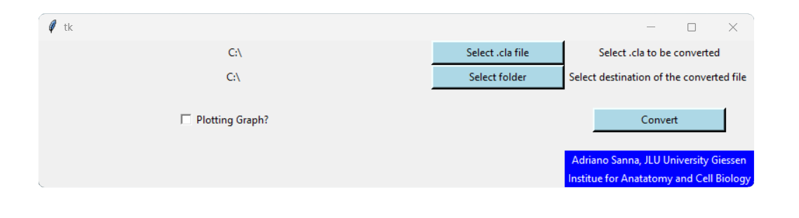

## Summary

Ussing Chamber is a device used to record the current generating by transepithelial ion transport in biological membranes. The Ussing chamber device produced by “Scientific Instruments” is provided with a software, Clamp (developed by M. Ing. A. Mund),  that produces files using the .cla extension. These files can be imported into excel, but the data elaboration takes a significant amount of time for the operator. The presented python [@Vanrossum2009] program, sunny.py, converts the .cla files into .xlsx file, thanks to a graphic user interface (GUI, Fig.1, tkinter library). This conversion allows a good automatization in data analysis: (1) the user will have the new tables having in the first line the titles and in the following lines directly the data. Data in this format can be directly imported into R (2) the intervals of drugs administration are reported in a specific column, making it easier to the operator to have an overview on the experiment workflow (3) delta of the electric Intensity per square centimeter of biological tissue (Isc) is automatically calculated.

## Statement of need

"Sunny.py" is a program developed to make Ussing chamber data analysis faster and more reliable. By importing the Ussing Chamber data (.cla) into excel the user encounter many obstacles: (1) data are not ordered in a title-data manner (2) it´s difficult to find the time of chemical injection (3) intervals between two chemicals administrations are not specified (4) basic statistic is not reported. All this work take a significant amount of time to a  scientist and since this work consists of dragging and copying intervals of data, the human error becomes possible. With Sunny there is a completely automatization of this process. The user will use an intuitive point and click interface. The design is very simple with only 4 buttons: one for selecting the file, another one for selecting the file destination, a tick-button to save the preliminary graph and a button to convert the file.

## Conclusions
This programm allows a considerable improvment in processing the results obtained by the Ussing chambers running Clamp as data recorder: (1) data elaboration is faster (2) human error is minimized. Provided with a point and click interface, it´s easy to use and accessible also for non programmer. 

## Acknowledgements

I would like to thank Petra Mermer and my team colleagues for introducing me to the Ussing chamber and sharing with me their knowledge (and coffee).

## References
---
nocite: '@*'
---
